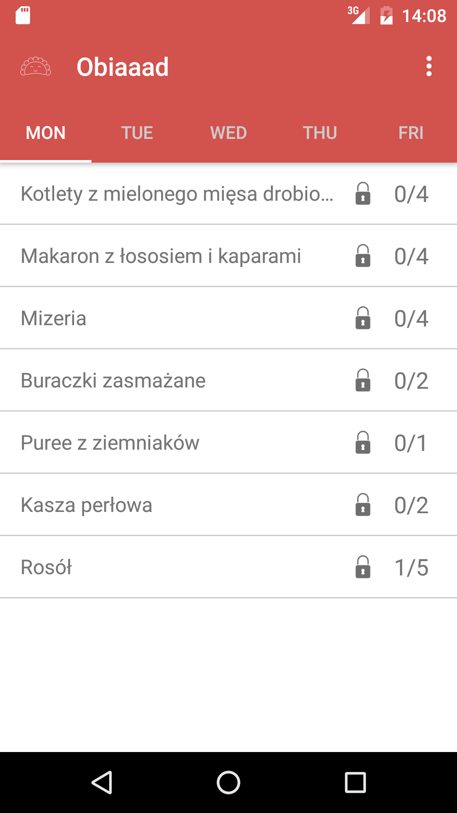

# KetchupLunch

This application serves as our lunch menu. Every day at 13:37 we eat lunch together at our cool office, catered by the lovely couple Hanna and Tadeo. The only problem we have with lunch right now is ordering. The menus for the upcoming week are provided in a Google Sheet which we have to fill out before each Friday.

Application contains five tabs with lunch menus for each given day, a list with the number of meals ordered by the logged in user, and the total number of orders for every given meal. We’re using the Google Sheet API as our backend. 

    
    

We decided to choose Kotlin as our programming language. There is some good stuff out there about learning Kotlin [https://kotlinlang.org/docs/tutorials/], so we decided to focus on a less documented but still very interesting topic -- creating Android layouts in code with the help of the Kotlin Anko [https://github.com/Kotlin/anko] library.

This application serves as example for post published on our blog: http://macoscope.com/blog/kotlin-anko-layouts/

## Libraries Used
- Kotlin Anko https://github.com/Kotlin/anko/
- RxJava https://github.com/ReactiveX/RxJava/
- RxKotlin https://github.com/ReactiveX/RxKotlin/
- RecyclerView-FlexibleDivider https://github.com/yqritc/RecyclerView-FlexibleDivider/
- Google APIs Client Library for Java https://github.com/google/google-api-java-client/

